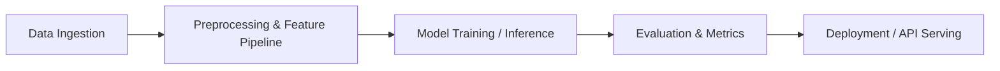

# [Project Name]

> [One-line summary of the problem and technical solution]

[](#)
[](#)
[](LICENSE)

---

## 🎯 Problem Statement
[Clearly describe the practical or industry problem this project addresses.]

## 💡 Proposed Solution
[Detail how machine learning, computer vision, NLP, or an agentic pipeline solves the stated problem.]

## 🏗️ Architecture


## 🚀 Getting Started

```bash
# 1. Setup virtual environment
python -m venv .venv
source .venv/bin/activate  # On Windows: .venv\Scripts\Activate.ps1

# 2. Install dependencies
pip install -r requirements.txt

# 3. Run application
python src/main.py
```

## 👥 Contributors & Maintainers
- **Developer:** [Name / GitHub Handle]
- **Organization:** AIML Club – Oriental College of Technology, Bhopal
